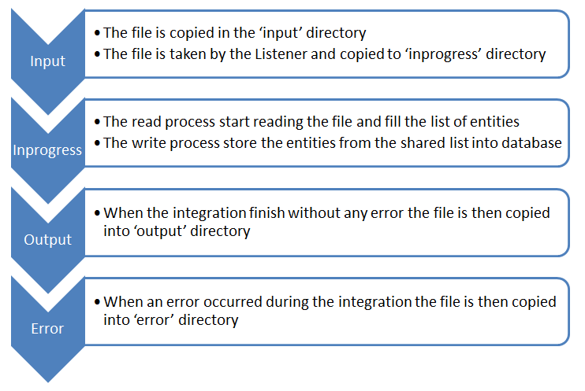

# Integration 



The file integration follow the process above. The project [common-task](https://github.com/jyacine/integration/tree/master/task-parent/task-common) define this process.
You can use this project for every king of integration process. You can do it by implementing the services bellow :
**ReportService**
This service have the goal to add the information about the file integrated
```java
public class MyReportService implements ReportService {
    .....
}
```
**IntegrationService**
This service have the goal to read from file and store the entities into database
```java
public class MyIntegrationService implements IntegrationService {
    .....
}
```
**IntegrationFileListener**
You can then extends IntegrationFileListener by defining the type of :
* ReportId
* ReportEntity
```java
public class MyIntegrationFileListener<ReportId,ReportEntity> extends IntegrationFileListener {
}
```
# Configuration
There is 4 steps for integration. Each step have its own directory :
* **input**: where the file is created
* **inprogress**: where the file is been processing
* **output**: where the file is copied when the integration went well
* **error**: where the file is copied whe the integration went wrong
Theses directories must be created under de configration below (application.yml)
```yml
oculus:
  task:
    directory: d:\\work\\task
```

# Build 
You can build the entire project from [task-parent](https://github.com/jyacine/integration/tree/master/task-parent/) by 
```sh
mvn clean install
```
These build create a fatjar. So you can run from the fatjar in the target
```sh
java $JAVA_OPTS  -jar ${FATJAT}.jar
```
**DOCKER**
You can run the build and process the Integration Test by:
```sh
mvn clean install -Denv=docker
```
(*): docker engine is pre-requis. if you use windows please check [docker for win](https://docs.docker.com/docker-for-windows/install/)

# Display with swagger
You can use the API Rest to see the integration by using swagger interface. Please check the following url when the application are up
```sh
http://localhost:${port}/swagger-ui.html
```
